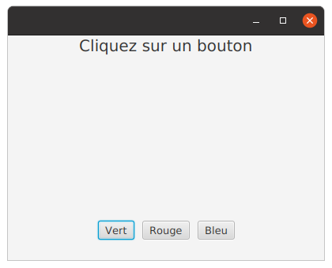
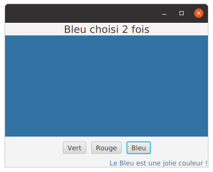
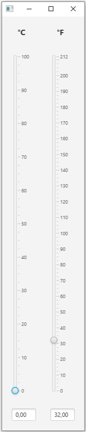

## TP 2 : gestionnaires d'événement et propriétés

Tout au long du TP, vous aurez certainement besoin de **consulter les pages de documentation** de JavaFX, qui sont [disponibles ici](https://openjfx.io/javadoc/18/).


Le but de ce TP est de vous familiariser avec la notion de [**Propriété**](https://wiki.openjdk.java.net/display/OpenJFX/JavaFX+Property+Architecture) en JavaFX. Pour un objet donné, les propriétés définissent son état accessible en lecture/écriture, et qui de plus, peut être _observé_ lors de son changement.

La notion sœur de propriété et la notion de **binding**. Il s'agit d'une valeur **X** qui est _liée_ à un certain nombre de valeurs observables **x<sub>1</sub>, x<sub>2</sub>, x<sub>3</sub>...** : si un changement d'une des valeurs observables a lieu, alors **X** est automatiquement recalculé. Toutes les classes de propriétés de JavaFX permettent la création des bindings et l'ajout des écouteurs de changement (**listeners**). Pensez à consulter le [cours et les différents supports](https://ametice.univ-amu.fr/course/view.php?id=105188) avant de poursuivre.

### Exercice 1 - Premières propriétés et bindings simples

On reprend l'exercice 2 du premier TP qui change la couleur d'un panneau et affiche combien de fois un bouton a été cliqué. Mais cette fois-ci nous allons complexifier un peu le comportement des éléments de la fenêtre. Désormais il faudrait que les clics changent également le texte et la couleur d'un label situé tout en bas de la fenêtre.

  

1. Associez à chacun des trois boutons, 3 événements avec la méthode de convenance `setOnAction(event -> ...)`.

2. Ajoutez à la classe un attribut `nbFois` de classe `IntegerProperty` et instanciez-le dans un constructeur en utilisant la classe concrète `SimpleIntegerProperty`. Cette **propriété** devra changer dynamiquement en fonction du bouton cliqué et du nombre de clics. Changez le code de vos gestionnaires d'événement de façon à utiliser la propriété `nbFois` lors de l'affectation du texte du label `texteDuHaut`.

3. Ajoutez maintenant un attribut `message` de classe `StringProperty`, instanciez-le dans le constructeur en utilisant `SimpleStringProperty`. Dans les gestionnaires d'événement, ce message sera affecté au texte du `Button`.

4. Transformez l'affectation du texte du label `texteDuHaut` en un **binding** sur la propriété `Text` du label et déplacez ce nouveau code à l'extérieur du gestionnaire d'événement. Vous utiliserez la méthode statique `concat(...)` de la classe [`Bindings`](https://openjfx.io/javadoc/18/javafx.base/javafx/beans/binding/Bindings.html) (pour concaténer un nombre variable de chaînes de caractères), et la méthode `asString()` (pour lier avec une `String` correspondant à une expression numérique). Pour l'instant, ne vous préoccupez pas de l'état initial du `Label`.

5. De même, déclarez un attribut `couleurPanneau` de classe `StringProperty`. Vous l'instancierez comme ceci : `couleurPanneau = new SimpleStringProperty("#000000");`.
   Mettez à jour l'objet `couleurPanneau` dans le gestionnaire d'événement en utilisant (uniquement) la valeur de la couleur correspondante au bouton choisi, et enfin, ajoutez un binding sur la propriété `Style` du panneau.

6. Extrayez les deux instructions de binding dans une méthode privée `createBindings()`. Dans cette méthode, déclarez et instanciez une variable `pasEncoreDeClic` de type `BooleanProperty`. Liez cette variable de façon à ce qu'elle change lorsque `nbFois` n'est plus égal à 0. Pour cela, retrouvez la version appropriée de la méthode `equal()` de `Bindings`.<br/>Transformez ensuite le binding sur le label `texteDuHaut` afin de gérer sa valeur initiale en utilisant `Bindings.when`.

7. **Sans toucher au code** des gestionnaires d'événement de vos boutons, faites en sorte que le label `texteDuBas` affiche le texte en fonction de `message` et de `couleurPanneau`. Par exemple, si le bouton *Rouge* a été cliqué, le texte de `texteDuBas` devrait être colorié en rouge et afficher "*Le Rouge est une jolie couleur !*".


### Exercice 2 - Écouteur de changement

On continue de travailler sur la palette, mais à partir d'un code initial un peu différent. Consultez les fichiers `Palette.java` et `CustomButton.java`.

1. Ajoutez dans la classe `CustomButton` les 3 méthodes usuelles pour la propriété `nbClics` (pensez à utiliser les facilités de votre IDE...). Ajoutez aussi la méthode `getCouleur()`.

2. Ajoutez, dans le gestionnaire d'événement de la classe `Palette`, le code qui incrémente le nombre de clics du bouton qui a reçu l'événement.

3. Définissez un attribut `nbClicsListener` de type [`ChangeListener<Number>`](https://openjfx.io/javadoc/18/javafx.base/javafx/beans/value/ChangeListener.html) et implémentez-le dans la méthode `start()` (de la classe `Palette`) de façon à actualiser le label `texteDuHaut` et le style du panneau. Pour vous guider, remarquez que l'interface `ChangeListener<T>` est une interface fonctionnelle de JavaFX, sa seule fonction abstraite étant `changed(ObservableValue<? extends T> obsevée, T ancienneValeur, T nouvelleValeur)`. Le paramètre `observée` correspond à la source à laquelle l'écouteur sera associée, les deux autres paramètres étant la valeur actuelle de la source et la nouvelle valeur à utiliser.

   Associez cet écouteur de changement à la propriété `nbClics` de chacun des 3 boutons.

4. Modifiez l'implémentation de la méthode `changed(...)` de `nbClicsListener` afin de modifier également le label `texteDuBas` (avec le même effet que dans l'exercice précédent).

### Exercice 3 - Liste observable

Dans le fichier `MainPersonnes.java`, on va travailler avec une liste de personnes `lesPersonnes` qui peut évoluer, par ajout, suppression et modification d'éléments. Observez la déclaration et l'instanciation de cette liste, objet qui est une propriété `Observable`, ce qui signifie qu'on pourra y attacher des écouteurs, ou la lier à d'autres propriétés.

1. Dans cette question, vous allez compléter la fonction principale `main(String args[])` de la classe `MainPersonnes`, de façon à définir un écouteur de changement sur la liste `lesPersonnes` (variable `unChangementListener`).

   [ListChangeListener](https://openjfx.io/javadoc/18/javafx.base/javafx/collections/ListChangeListener) est une interface fonctionnelle dont la méthode à implémenter n'a qu'un argument. Cet argument, de type [ListChangeListener.Change](https://openjfx.io/javadoc/18/javafx.base/javafx/collections/ListChangeListener.Change.html), permet d'accéder aux informations des éléments qui ont changé dans la liste. Pour pouvoir exploiter un changement, il faut (au moins une fois) exécuter la méthode `next()` sur cet argument, et ensuite, suivant le type de changement, appliquer les changements voulus (le code dé réaction).

   Pour savoir quel type de changement a eu lieu, vous pouvez utiliser des méthodes booléennes comme `wasAdded()`, `wasRemoved()`, `wasUpdated()` etc. On peut aussi utiliser la méthode `getAddedSubList()` qui retourne la liste de tous les éléments ajoutés. Pensez à lire la documentation de [ListChangeListener.Change](https://openjfx.io/javadoc/18/javafx.base/javafx/collections/ListChangeListener.Change.html) avant de poursuivre.

   Pour l'instant, votre code ne traitera qu'un seul ajout à la fois, et se contentera d'afficher "_Pierre a été ajouté_" (quand la personne dont le nom est "_Pierre_" a été ajoutée...). Invoquez la méthode `question1()` pour voir le résultat.

2. On continue avec la suppression d'une personne de la liste, avec un code, à ajouter à l'existant, qui utilise maintenant `getRemoved()` et qui affiche "_Pierre a été enlevé_". Testez en remplaçant le précédent appel par celui de la méthode `question2()`.

3. Écrivez maintenant un code qui devrait réagir à une modification de l'âge en écrivant "_Pierre a maintenant ... ans_", et testez en appelant maintenant `question3()`. Vous devriez constater que l'écouteur ne réagit pas. Pourquoi ?

4. Transformez maintenant l'instanciation de la liste `lesPersonnes` par `FXCollections.observableArrayList(personne -> new Observable[] {personne.ageProperty()});`, qui permet d'exprimer que l'on souhaite écouter les changements sur la propriété `age` de la classe `Personne`. Modifiez le code dans la classe `Personne` en conséquence pour pouvoir compiler et testez à nouveau avec `question3()`.

5. Ajoutez un second écouteur (par exemple `plusieursChangementsListener`) sur la liste `lesPersonnes`. Cet écouteur gèrera plusieurs changements à la fois. Testez avec la méthode `question5()`. Vous pouvez constater que le listener est déclenché plusieurs fois dans le cas d'une modification de l'âge (par exemple en ajoutant un affichage en fin du code du listener).

### Exercice 4 - Low-level binding
Dans cet exercice, à chaque ajout/suppression/changement de personne dans la liste des personnes, on souhaite pouvoir recalculer automatiquement les informations de la liste en fonction de l'**intégralité** de son contenu. Les bindings simples (haut-niveau) ne sont donc pas suffisants.

Le bindings bas-niveau (low-level bindings) apporte plus de flexibilité modulo quelques lignes de code supplémentaires. Pour utiliser des bindings de bas niveau il y a trois étapes à respecter :

* Créer un objet qui correspondra à votre binding (par exemple de sous-type de `DoubleBinding` si la liaison doit se faire sur un nombre réel).
* Faire un appel à la fonction `bind(Observable... dépendances)` de la superclasse en lui passant en paramètre les dépendances à lier. Toutes les classes de binding ont une implémentation de la méthode `bind(Observable... dépendances)`.
* Redéfinir la méthode `computeValue()` en écrivant le code qui calculera (et retournera) la valeur courante du binding.

Voici un exemple de création de binding bas niveau pour le calcul de l'aire d'un rectangle :

```java
    DoubleProperty hauteur = new SimpleDoubleProperty(7.0);
    DoubleProperty largeur = new SimpleDoubleProperty(5.0);
    
    DoubleProperty aire = new SimpleDoubleProperty(); // valeur qui sera calculée à la volée
    
    DoubleBinding aireBinding = new DoubleBinding() {
        // constructeur de la classe interne anonyme
        {
           this.bind(hauteur, largeur); // appel du constructeur de la classe mère (DoubleBinding)
        }

        @Override
        protected double computeValue() {
            return hauteur.get() * largeur.get();
        }
    };
    aire.bind(aireBinding); // Liaison de la propriété aire au binding
    //  tous les changements de la hauteur et de la largeur vont être pris en compte :
        
    System.out.println(aire.get()); // affiche 35
    largeur.setValue(10);
    System.out.println(aire.get()); // affiche 70
```


1. On souhaite maintenant faire calculer automatiquement l'âge moyen des personnes dans la liste `lesPersonnes`. Consultez la nouvelle version des classes qui vous sont fournies. Instanciez le binding `calculAgeMoyen`, dont vous vous servirez pour que l'attribut `ageMoyen` soit actualisé au fur et à mesure des modifications de la liste `lesPersonnes`. Vous compléterez la classe `Personne` avec les méthodes dont vous pourriez avoir besoin, ainsi que le code de la fonction `main(String[] args)`, avant de tester avec la méthode `question1()`.

2. Écrivez un second binding `calculNbParisiens`, qui permettra de connaitre, grâce à l'attribut `nbParisiens`, le nombre de personnes nées à Paris. Testez ensuite avec la méthode `question2()`.

### Exercice 5 - Bindings

On reprend l'exercice du précédent TP qui affiche une interface de login.

Complétez la méthode `createBindings()` afin que :
- le champ du mot de passe ne soit pas éditable si le nom de l'utilisateur fait moins de 6 caractères,
- le bouton `cancel` ne soit pas cliquable si les deux champs sont vides,
- le bouton `ok` ne soit pas cliquable tant que le mot de passe n'a pas au moins 8 caractères, et ne contient pas au moins une majuscule et un chiffre.

**Remarque** : n'oubliez pas d'initialiser correctement votre contrôleur...

### Exercice 6 - Bindings bidirectionnels

Dans cet exercice, on cherche à visualiser la correspondance entre deux températures, l'une exprimée en degrés Celsius et l'autre en degrés Fahrenheit.
Pour cela, on utilisera 2 composants graphiques `Slider`, le premier (donnant la température en Celsius) qui pourra varier entre 0°C et 100°C, et le second qui pourra varier entre 0°F et 212°F, comme sur l'image ci-dessous :



Pour plus d'information sur la relation entre les deux unités de mesure de température et les règles de conversion : https://fr.wikipedia.org/wiki/Degr%C3%A9_Fahrenheit

1. Créez un binding bidirectionnel qui permettra que toute variation d'un des 2 curseurs provoque automatiquement le changement correspondant dans le second.

2. Ajoutez maintenant les températures exprimées sous forme de texte dans les`TextField` et faites en sorte qu'elles soient liées de manière bidirectionnelle avec les sliders correspondants. Vous pourrez avoir besoin d'utiliser la méthode statique [`bindBidirectional`](https://openjfx.io/javadoc/18/javafx.base/javafx/beans/binding/Bindings.html#bindBidirectional(javafx.beans.property.Property,javafx.beans.property.Property,javafx.util.StringConverter)) de la classe utilitaire [`Bindings`](https://openjfx.io/javadoc/18/javafx.base/javafx/beans/binding/Bindings.html).<br/>